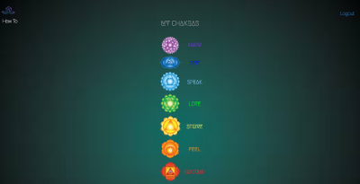
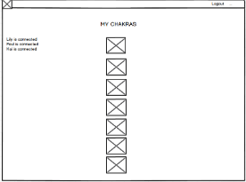
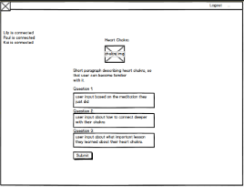

##My Chakras

This app uses Express.js, a Node.js framework, for its backend and MongoDB for
database storage. Users are able to record their input and save them in the database.

    

##Overview

My Chakras guides the user through meditation and yoga poses, they are also
able to write about their experience doing the exercises and save them for future
reference.

##Use Case

There's no doubt that our recent technological advancements have allowed us to stay
better connected and made our lives easier in many ways. But when we constantly
focus on a device instead of ourselves and what's going on around us we miss a
great deal. Whether one believes in chakras or not, this app can be useful to
anyone who wants to achieve more balance in mind and body through meditation and
yoga.

My chakras is the perfect tool for users to become more familiar with the seven
chakras. Each chakra focuses on different parts of us, and we can do meditation
and yoga stretches to focus and unblock energies on these parts. Users are then able
to write about what they learned about the chakra. This app is useful for anyone
who wants to achieve more balance between mind and body.

##UX

The initial wireframes can be seen below:

     

###Tech Stack

* Passport Authentication
* MongoDB
* Mongoose
* Mocha Testing
* Travis CI
* Heroku

[My Chakras](https://agile-springs-89459.herokuapp.com/) let's the user register
and login using passport authentication methods. The user's name and password information
is stored inside the mongodb database which is hosted by mLab.  Once the users are logged in they
can choose which chakra meditation to try by clicking on one of the chakra links.

This brings the users to the individual chakra page, from there they are asked to
do a meditation and yoga pose.  They are asked to write down their experiences in three
separate text input fields.

The data from the three text input fields gets stored inside an object along with the
user's name and password information.  We use different mongoose methods to save, find and
update our database with the user's input information.  A response gets send to the
front-end and updates it so that when users log in next time, they can see their
input about the chakra saved from last time.

Testing is done through Mocha, which in combination with Travis CI allows for continuous
testing.  Every time we push up to github, Travis CI automatically runs mocha and deploys
directly to Heroku only if all the tests pass.
